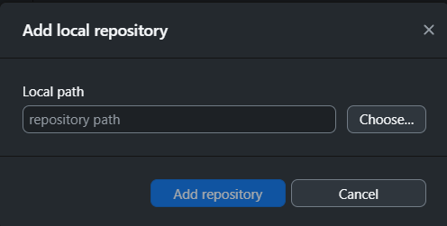
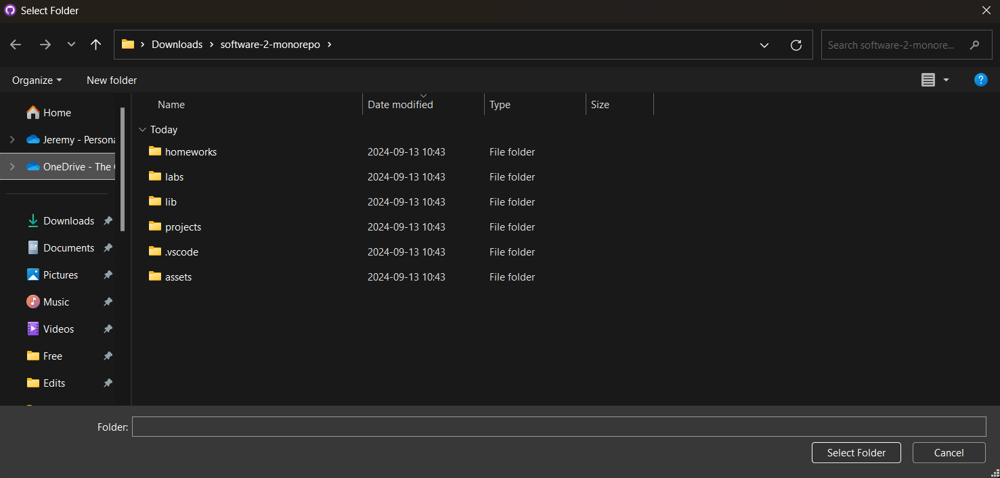
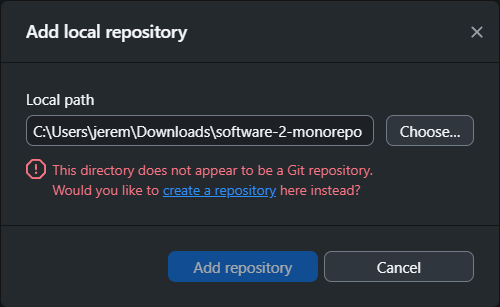
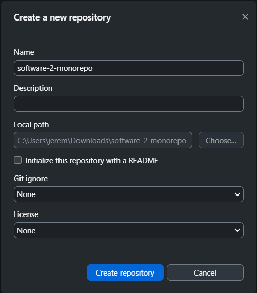
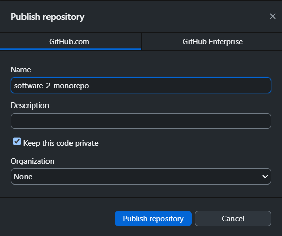
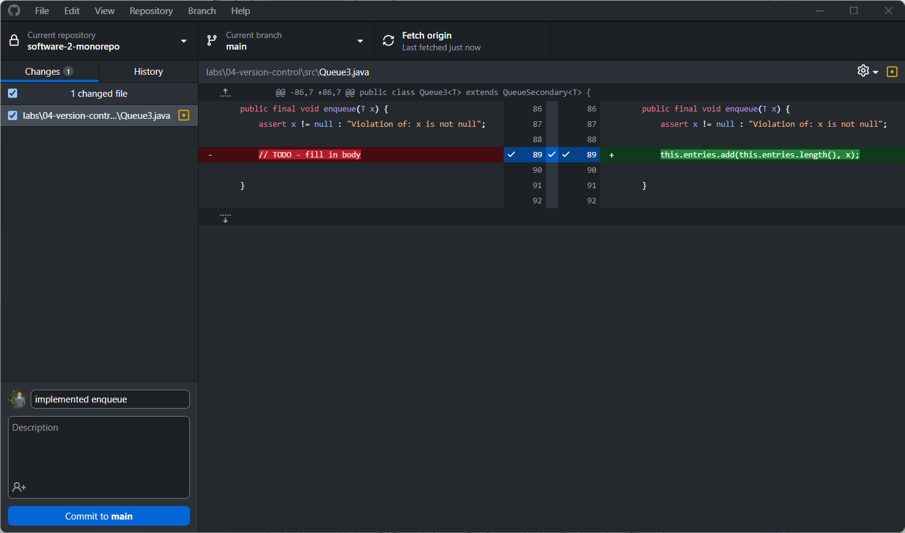

# Lab 4: Version Control

## Objective

In this lab you will learn how to use the git version control system to
share VSCode projects with your teammate. You will also practice implementing
and testing a kernel component, Queue3 implemented on Sequence.

## Setting up Git

There are many ways to setup git, but we don't have the luxury to actually
introduce them. As a result, we will be approaching git in the easiest way
possible using GitHub Desktop, a GUI-based tool. If you would like to learn how
to use git (the hard way), there are a few bonus sections below.

### Installing GitHub Desktop (<ins>all team members</ins>)

To get started, head to the
[GitHub Desktop download page](https://desktop.github.com/download/), and
download and install the tool.

### Creating a Git Repo (<ins>only one member per team</ins>)

To share your projects and keep track of the history of the changes to the
projects, you will need to set up a git repository. <ins>This is a simple task
that only one team member must handle</ins>.

The repository for your team will reside on GitHub, an industry standard tool
for hosting open-source software. Typically, there are two ways to approach
this: one repository per project or one repository for all projects. In this
course, we will be using the latter approach (i.e., the monorepo approach).

To create a repository, we will be using your existing software-2-monorepo
folder. Don't worry! Your homeworks and labs will not be shared with your
teammate. To share your monorepo, open GitHub Desktop. Then, do the following:

1. Click `File` then `Add Respository` OR press <kbd>CTRL</kbd> + <kbd>O</kbd>.

   

2. Select the folder of your monorepo using the `Choose...` button. Make sure
   the folder you select has a `.vscode` folder at the root.

   

3. Because your monorepo is not an existing git repo yet, you will see a warning
   that reads something like: `This directory does not appear to be a Git
   repository. Would you like to create a repository here instead?`. Click
   the `create a repository` link.

   

4. You will be brought to the `Create a new repository` window with all of the
   information already correctly filled out for you. You should be able to
   select `Create repository` to officially create your git repo locally.

   

5. Now, you can publish your local repo to GitHub using the `Publish repository`
   button. Make sure to keep the `Keep this code private` box checked. You
   may add a description if you'd like. You may also change the name if you'd
   like.

   

### Sharing Your Repo (<ins>same team member as last step</ins>)

Because your repo is private, you will need to add your teammate as a
collaborator.GitHub Desktop may have already opened the repo for you when you
published. If not, you can go to GitHub to find your repo there OR click the
repository tab and select `View of GitHub` OR make use of the shortcut
<kbd>CTRL</kbd> + <kbd>SHIFT</kbd> + <kbd>G</kbd>.

At any rate, once in your repo on GitHub, click on the `Settings` tab. In the
sidebar, you will see the `Collaborators` tab. From there, you can click
the `Add people` button and enter your partners username or email address.
If you're having trouble finding this page, the URL path is as follows:
`https://github.com/username/repo-name/settings/access`.

### Cloning a Repo (<ins>other team member</ins>)

Assuming the first teammate set everything up correctly, the next step is to
clone the repo to your computer. Again, there are a lot of ways to do this, but
the easiest way is to select `Clone repository` option under `File` on GitHub
Desktop. However, there is a problem with this option: you will end up with
two monorepos on your system.

**Instead**, you will want to clone the repo on top of your existing monorepo.
Git does not have a way to do this easily. As a result, we'll have to turn to
the command line. However, GitHub Desktop may not install git on your system.
As a result, there are a few things you may need to do first. For example,
start by checking that git is installed via the terminal:

```sh
git --version
```

If git is installed, you should see something like the following:

```sh
git version 2.29.2.windows.2
```

If not, you will need to install it. On Windows, this is easy. You can download
it directly from the [git website](https://git-scm.com/downloads). On Mac, you
can run the following command from the terminal:

```sh
xcode-select --install
```

At this point, you may want to restart VSCode, then verify again that you
have git installed. Next, you will need to run a series of commands.

1. You need to clone the repo to a temporary folder inside your existing folder.
   You can do that with the following git command. The URL can be found on
   GitHub by clicking the green `Code` button OR by taking the webpage URL
   and adding `.git` to the end.

   ```sh
   git clone https://myrepo.com/git.git temp
   ```

2. Next, you will want to copy the `.git` folder over into your existing repo.

   ```sh
   mv temp/.git .
   ```

3. Finally, you can delete the temp folder. On Unix-based systems like Linux
   and Mac, you can run the following command. Otherwise, you can just right
   click the temp folder and delete it.

   ```sh
   rm -rf temp
   ```

Congrats! You both have a repository in working order.

## Working Together

Now, the hard part: learning to use git. To do that, we'll be using the
`Queue3.java` file in the src folder of the 04-version-control lab.
For the purposes of the lab, we will be working directly off of main (note:
don't worry if this means nothing to you at the moment).

To start, pick a teammate to make some changes to the `Queue3.java` file.
When the lab says swap, move to the next teammate.

### Implement Enqueue (pick a teammate to do this)

1. Complete the body of `enqueue()` and save the file.
2. Open GitHub Desktop. You should see your changes listed.

   

3. Git has this concept of staging, which allows you to pick and choose which
   files you want to commit. You can manually select the files in GitHub Desktop
   by clicking the checkbox next to each file. The file should already be
   checked, so you can move on to step 4.
4. Write the following commit message in the summary box: `implemented enqueue`
   and click `Commit to main`.

   

5. When you commit files, they are only committed locally. To ensure the changes
   are pushed to GitHub, there should be an option to push in the top bar of
   GitHub Desktop. Click it. You changes will now appear on GitHub.

   

### Implement Dequeue (pick another teammate to do this)

6. Complete the body of `dequeue()` and save the file.
7. Write the following commit message in the summary box: `implemented enqueue`
   and click `Commit to main`. Feel free to reference the images above.
8. Again, this change is only committed locally. Because there is already a new
   change on GitHub, you may be prompted to `Pull origin`. In practice, we
   always pull before we push, so GitHub Desktop will ask you to do so. Click
   the pull button.
9. Because you and your partner have edited separate parts of the same file,
   you should not have any issues when you pull. After pulling, you can press
   the button again to push.

### Getting Latest Changes (go back to first teammate)

11. The previous teammate should be up to date. If you want to be up to date
    too, you should open GitHub Desktop and select `Fetch origin`. GitHub
    Desktop is good about doing this for you, so you may not even see `Fetch
    origin` as an option. Instead, you will see `Pull origin`. In which case,
    you should pull.

### Causing a Conflict (both teammates)

12. Now that you're both up to date, both of you should implement the
    `length()` method: one using the length method of entries and the other
    using a loop. We want two different solutions.
13. Both of you should commit your solution, and both of you should attempt to
    push.
14. Depending on the order of pushes, one of you will be left with a nasty merge
    conflict. This occurs when two people edit the same line. Git doesn't know
    which line you want, so it flags it as a conflict. You must manually go
    through the code and fix the conflict. Luckily, GitHub Desktop will likely
    prompt you to edit the conflict in VSCode. When you go back to VSCode, you
    should see conflicts highlighted directly in the file for you. You will be
    given four options for each line in conflict: accept current change, accept
    incoming change, accept both changes, or compare changes. It will not always
    be obvious which change is correct, so you will have to make an informed
    decision about what changes you want.

**Note**: lines of code not in conflict will be merged normally, even if you
don't want them. For example, if the person who wrote the loop syncs last, their
loop will likely stay intact. They will have to choose between the two different
return statements. Of course, they should amend their solution to remove the
loop.

### Verifying the Code

At this point, you can run the test files like normal to ensure your implemented
the kernel correctly. If everything works, you're done! In the future, I might
include a way to run the tests automatically on GitHub as well. If that's
something you're interested in, check out GitHub Actions.

## Bonus: a Better Workflow

Unfortunately, one lab isn't enough time to teach you how git works properly.
You will likely spend most of this semester only scratching the surface of the
tool. That said, my general advice is to make use of branching for every single
project. To do that, follow these steps:

1. Have one teammate create a branch off of main. This can be done easily in
   GitHub Desktop by clicking the `Current branch` button and then clicking
   the `New branch` button. Make sure the branch is based off of `main`. You
   can select whatever name you like.
2. Like everything in git, creating a branch is not enough for it to appear to
   your team on GitHub. You will need to next click the `Publish Branch` button.
   It is the same button as fetch, push, and pull.
3. Now, treat this new branch just like you would `main`. Commit, pull, and push
   to it until you're finished with the project.
4. When the project is complete, you will create a pull request to GitHub.
   Normally, this is very easy from GitHub Desktop. Click the `Branch` tab
   and select the bottom option: `Create pull request`. Alternatively, there
   is a keyboard shortcut: <kbd>CTRL</kbd> + <kbd>R</kbd>.
5. Give your pull request a title like "Completed Project 2" and describe
   what you did.
6. Next, let your teammate know that the project is complete and give them
   a chance to review the code. Your teammate should be able to review the
   code and make comments. If they're satisfied, they can approve of it.
7. Once approved, merge the pull request into main. My preference is to use the
   squash and merge feature, which makes the history a bit cleaner. However,
   any merge should be fine.

If you follow this process for every project, you'll be using git in a much more
professional manner. Please consider this workflow even though we will never
see you do it.

## Bonus: Git Commandline

At some point, you will break git. As a result, it's a good idea to get familiar
with the commandline. Here are a few commands I would memorize:

1. `git init -b main`: converts the current folder to a git repo with a branch
   names "main"
2. `git status`: gets the current status of the git repo; probably the most
   useful command
3. `git add .`: adds everything that is not ignored by the `.gitignore` to be
   committed
4. `git commit -m "your message"`: makes a local commit with a commit message
5. `git fetch`: tells you if there are any changes on GitHub that are not in
   your local branch
6. `git pull`: pulls the latest changes to the current branch
7. `git push`: pushes the latest changes to the current branch (always pull
   first)

There are probably hundreds of git commands, but these are enough to make you
dangerous.
